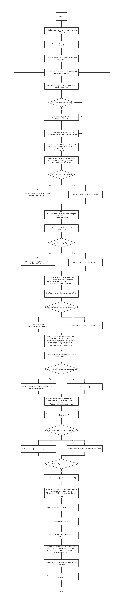

# Team Project repo

# STEPS FOR TESTING
1) Your accounts have been created already , username is : netid , password:Stellar123!  
2) Login to your account and click on services to fill out your preferences.  
   Click on Services , and fill out your preferences.  
3) We have selected random preferences for everyone, we request everyone to fill their actual preferences before 11:45 PM on the testing day i.e. 11/26.  
4) If u want to test the signup , use your NYU alias email, as your netid has already been registered.  
5) We will run our matchmaking algorithm at 12pm 11/26/19. Please fill out your preferences before noon.
6) Check the match history to check who you have been matched with. 
7) Also, we will send an email with a google calendar invite to your matched meeting at 5pm (we decided to make it at 5 pm so that users have plenty of time to click on "Yes", "Maybe" or "No" for the event invitation; therefore technically this event won't be a "lunch"). The details of the restaurants that have been selected based on your preferences will also be displayed in the email message.  
8) After matching, you will get another email with a feedback form at 5:30 pm that you will need to fill out based on your experience with your match.

#Timeline for Testing on Test day 26/11/19

1) 9:00 AM to 11:45 AM Select and change preferences for test users.
2) 12:00 PM Users will get matched and sent out emails with Lunch Mate information and restaurant recommendation.
3) 5:30 PM Users will get a feedback form. 

Matching algorithm flow chart

